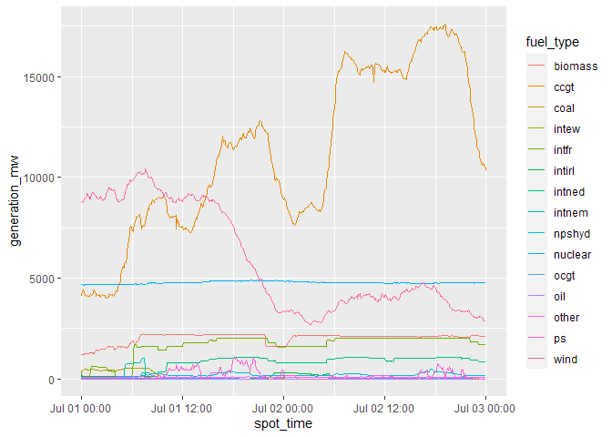

<!-- README.md is generated from README.Rmd. Please edit that file -->

# BMRSr <a href='http://bmrsr.arawles.co.uk'></a>

[](https://cran.r-project.org/package=BMRSr)
[](https://travis-ci.org/ARawles/BMRSr)
[](https://codecov.io/github/ARawles/BMRSr?branch=master)
[](https://cran.rstudio.com/web/packages/BMRSr/index.html)

## Overview

The goal of BMRSr is to provide wrapper functions to make use of the
[Balancing Mechanism Reporting System
API](https://www.elexon.co.uk/wp-content/uploads/2017/06/bmrs_api_data_push_user_guide_v1.1.pdf)
easier for R users. <br> The [Balancing Mechanism Reporting
System](https://bmreports.com/bmrs/?q=eds/main) (or BMRS) is a platform
for energy-related data in the UK. Here, data relating to energy
generation, demand, transmission and balancing services can all be
accessed for free. The BMRS is therefore a platform for enthusiasts,
academics and professionals to extract energy data for analysis and
modelling. Also associated with BMRS is an API which allows for access
to all the data items currently available through the UI. <br> This R
package contains functions to help build the API requests, send them,
retrieve the requested data and parse it.

## Installation

You can install BMRSr from CRAN with:

``` r
install.packages("BMRSr")
```

You can install the development version of BMRSr from
[GitHub](https://github.com/ARawles/BMRSr) with:

``` r
devtools::install_github("BMRSr")
```

**You’ll also need an API key. You can get this by registering on the
[ELEXON portal](https://www.elexonportal.co.uk).**

## Usage

BMRSr contains functions that can be split into 4 main categories:

  - Build
  - Send & Receive
  - Parse
  - Utility

### End-to-End

To perform a complete API request (build the call, send and receive the
data, and then parse it), use the `full_request()` function.

``` r
full_request(data_item = "B1720",
             api_key = "test",
             settlement_date = "12 Jun 2018",
             period = "1",
             service_type = "csv")
```

### Build

These functions build the URL for the API request. The main function
`build_call()` is the one you’ll likely be calling, but all this does is
call the appropriate `build_x_call()` function for the data item you’ve
requested. For example:

``` r
build_call(data_item = "B1720",
           api_key = "12345",
           settlement_date = "1 Jan 2018",
           period = "1",
           service_type = "csv")
#> $url
#> [1] "https://api.bmreports.com/BMRS/B1720/v1?APIKey=12345&SettlementDate=2018-01-01&Period=1&ServiceType=csv"
#> 
#> $service_type
#> [1] "csv"
#> 
#> $data_item
#> [1] "B1720"
```

actually calls

``` r
build_b_call(data_item = "B1720",
             api_key = "12345",
             settlement_date = "1 Jan 2018",
             period = "1",
             service_type = "csv")
#> $url
#> [1] "https://api.bmreports.com/BMRS/B1720/v1?APIKey=12345&SettlementDate=2018-01-01&Period=1&ServiceType=csv"
#> 
#> $service_type
#> [1] "csv"
#> 
#> $data_item
#> [1] "B1720"
```

These functions return a list of three items:

  - the url as a character string (`$url`)
  - the service type/return format (`$service_type`)
  - the data item (`$data_item`)

The input parameters you provide will be checked against those that are
valid for the data item you are requesting, however there is no check on
whether you have provided (at least) the required parameters for the
data item.

To see all the allowed input parameters for each type (not each data
item), use `?build_[type]_call`.

To see which input parameter you need for your data item, use
`get_parameters(your_data_item)`.

### Send & Receive

This function - `send_request()` - sends the provided URL to the API and
returns a response() object with the added attribute of data\_item\_type
(one of “B Flow”, “Remit”, or “Legacy”). Config options can also be
supplied via the config\_options parameter as a named list, that will be
passed to the `httr::GET()` function (implemented primarily for proxies
and the like).

This function can be used with a premade url, however the user will also
have to respecify the data item and service type (format) from the URL:

``` r
send_request(
  list(
    url = "https://api.bmreports.com/BMRS/B1720/v1?APIKey=12345&SettlementDate=2018-01-01&Period=1&ServiceType=csv", 
                  data_item = "B1720", service_type = "csv")
)
```

### Parse

This function - `parse_response()` - takes the response() object
returned from the send\_request() function, and parses the response base
on the service\_type parameter (whether it was “csv” or “xml”). CSVs
return tibbles, and XMLs return lists. The returned CSVs from many of
the calls contain unnecessary or incorrect data, so this parsing
function will remove that data before returning a corrected response.

``` r
parse_response(
  send_request(
    list(
      url = "https://api.bmreports.com/BMRS/B1720/v1?APIKey=12345&SettlementDate=2018-01-01&Period=1&ServiceType=csv", 
                    data_item = "B1720", service_type = "csv")
  )
)
```

### Utility

These functions support the functionality of the previous 3 groups of
functions:

  - `get_function()` which returns the appropriate `build_x_call()`
    function needed for the `build_call()` function.
  - `check_data_item()` ensures that the request is for a valid data
    item.
  - `get_parameters()` returns a list with the allowed input parameters
    for the supplied data item.
  - `clean_date_columns()` reformats date/time/datetime columns based on
    their column names.
  - `get_data_items()` returns all valid data items.
  - `get_column_names()` retrieves the column headings for a particular
    data item (Legacy only as B flow responses already have column
    headings).
  - `get_data_item_type()` return the data item *type* of a particular
    data item. This is only really relevant to know which
    `build_x_call()` to use.

## Full example

Here’s a full example, using the package to return generation by fuel
type data and then plotting it using ggplot2.

``` r

api <- "your_api_key_goes_here"


#We're requesting the FUELINST data item here.
#A full list of all the data items can be returned using the get_data_items() function

#Find out which parameters we need to provide for the data item we've chosen...
get_parameters("FUELINST")
#> [1] "from_datetime" "to_datetime"
```

``` r
#Perform the full request and ask for a CSV back
gen_data <- full_request(data_item = "FUELINST",
                         api_key = api,
                         from_datetime = "2019-07-01 00:00:00",
                         to_datetime = "2019-07-03 00:00:00",
                         service_type = "csv")
```

``` r
#Load the libraries for a bit more cleaning and then plotting...
library(ggplot2, quietly = TRUE, warn.conflicts = FALSE)
library(dplyr, quietly = TRUE, warn.conflicts = FALSE)

head(gen_data)
#> # A tibble: 6 x 19
#>   record_type settlement_date settlement_peri~ spot_time            ccgt
#>   <chr>       <date>                     <dbl> <dttm>              <dbl>
#> 1 FUELINST    2019-07-01                     2 2019-07-01 00:00:00  4101
#> 2 FUELINST    2019-07-01                     3 2019-07-01 00:05:00  4354
#> 3 FUELINST    2019-07-01                     3 2019-07-01 00:10:00  4388
#> 4 FUELINST    2019-07-01                     3 2019-07-01 00:15:00  4290
#> 5 FUELINST    2019-07-01                     3 2019-07-01 00:20:00  4237
#> 6 FUELINST    2019-07-01                     3 2019-07-01 00:25:00  4176
#> # ... with 14 more variables: oil <dbl>, coal <dbl>, nuclear <dbl>,
#> #   wind <dbl>, ps <dbl>, npshyd <dbl>, ocgt <dbl>, other <dbl>,
#> #   intfr <dbl>, intirl <dbl>, intned <dbl>, intew <dbl>, biomass <dbl>,
#> #   intnem <dbl>

#Change the fuel types from columns to a grouping
gen_data <- gen_data %>%
  dplyr::mutate(settlement_period = as.factor(settlement_period)) %>%
  tidyr::gather(key = "fuel_type", value = "generation_mw", ccgt:intnem)


#Make a line graph of the different generation types
ggplot2::ggplot(data = gen_data, aes(x = spot_time, y = generation_mw, colour = fuel_type)) +
  geom_line()
```


